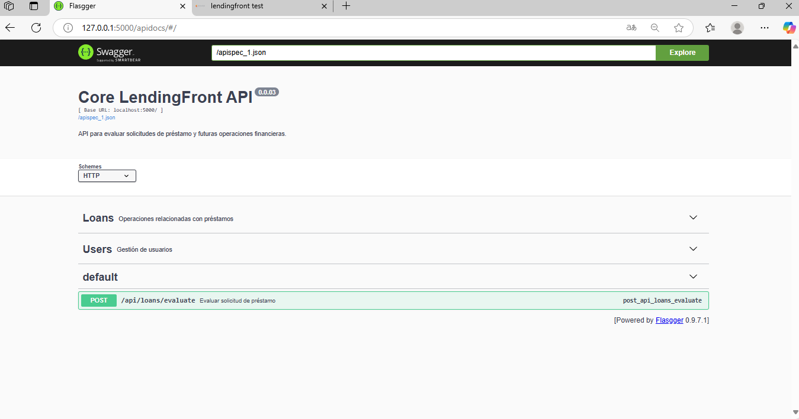

# Core LendingFront API

API to evaluate loan applications and manage future LendingFront system operations.

## Características

- Loan evaluation based on the requested amount; currently, a single endpoint.
- Layered architecture (Controllers, Business Logic, Data)
- SQLAlchemy + Flask-Migrate
- Interactive documentation with Swagger (Flasgger)
- Configuration by environment (Development, Testing, Production)
- Ready to scale

---

## Estructura del proyecto

backend-core-lendingfront/
├── app/                        # Carpeta principal donde está la aplicación Flask
│   ├── config/                 # Contiene las configuraciones de la app
│   ├── controllers/            # Define las rutas y controladores
│   ├── extensions/             # Configuraciones y extensiones (SQLAlchemy, Migrate, etc.)
│   ├── models/                 # Modelos de datos, representan las entidades de la base de datos
│   ├── repositories/           # Lógica de acceso a la base de datos, interactúa con los modelos
│   ├── schemas/                # Esquemas para validar y serializar los datos
│   ├── __init__.py             # Inicializa el paquete de la aplicación
├── migrations/                 # Carpeta generada por Flask-Migrate para las migraciones
├── create_app.py               # Función fábrica para crear la aplicación Flask
├── app.py                      # Archivo principal para ejecutar la aplicación
├── .env                        # Archivo de configuración de variables de entorno
└── README.md                   # Documentación del proyecto

## Swagger

Access by the http://127.0.0.1:5000/apidocs

## By
Carlos Andres Moreno alvarez

## API Documentation

Esta es una vista previa de la documentación de la API generada automáticamente con Swagger:

